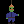
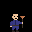
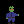
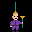

# Art Plumber

A fully on-chain pixel-art NFT: a little frog plumber who hangs from one
plunger and holds another. No IPFS, no servers — the ERC-721 contract itself
generates the SVG and the metadata JSON, so the art lives as long as the
chain does.

| Original | Head only | Hand only | Plungerless | Perfect match |
|---|---|---|---|---|
|  |  |  |  |  |

## The on-chain color match hunt

Every mint locks a random seed. That seed — and nothing else — decides the
token's look. **The full derivation — seed → nibbles → palette → SVG,
plunger presence, and how to verify it with `cast` — is documented in
[docs/how-it-works.md](docs/how-it-works.md).** The short version: seven
nibbles (4-bit values) of the seed are read:

| Seed nibble | Slot | What it determines |
|---|---|---|
| 0 | `headSucker` | color of the plunger **sucker** stuck on his head (covers his ears) |
| 1 | `heldSucker` | color of the **sucker** of the plunger he is holding |
| 2 | `headStick` | color of the plunger **stick** he hangs from |
| 3 | `heldStick` | color of the **other stick** (the held plunger's handle) |
| 4 | `suit` | color of his work suit |
| 5 | `boots` | color of his boots |
| 6 | plunger presence | which plungers appear (see below) |

All six color slots draw from the **same 16-color palette**, so any two
slots can roll the same color — that's a **match**, and matches are what
collectors hunt for:

| Trait | Condition | Odds |
|---|---|---|
| Suckers Match | both suckers on the art, same color | ~3.5% |
| Sticks Match | both sticks on the art, same color | ~3.5% |
| Uniform Match | suit == boots | 6.25% |
| **Perfect Plumber** | Double Plunger + Suckers Match + Sticks Match | ~0.22% (1 in 455) |

Matches are also readable on-chain via `matchesOf(tokenId)`, so games,
reward contracts, or burns can verify a hunter's pull trustlessly.

### Plunger presence (nibble 6)

Each plunger is itself a trait slot — sometimes it appears, sometimes it
doesn't:

| Roll (0–15) | Plungers trait | Odds |
|---|---|---|
| 0–8 | Double (head + hand) | 56.25% |
| 9–11 | Head Only | 18.75% |
| 12–14 | Hand Only | 18.75% |
| 15 | None (plungerless) | 6.25% |

Color traits of an absent plunger are omitted from the metadata, and sucker/
stick matches only count when both parts are actually on the art — so a
Perfect Plumber is always a Double. When the head plunger is present its
sucker covers the frog's ear bumps; otherwise the ears show.

### How randomness is determined (and why the hunt rewards skill)

There is no oracle and no off-chain randomness. The seed is computed
on-chain at mint, from three public ingredients:

```solidity
seedOf[id] = keccak256(abi.encodePacked(block.prevrandao, msg.sender, id));
```

- `block.prevrandao` — a value the chain exposes each block,
- `msg.sender` — the minter's address,
- `id` — the sequential token id being minted.

This is **not casino-grade randomness, by design**. Everything that goes
into the seed is public, so a skilled hunter can compute rolls before
minting:

- On Ethereum L1, `prevrandao` is fixed once the block is being built, so
  a hunter can simulate their mint each block and only send the
  transaction when the roll is good.
- On Arbitrum-lineage L2s (including Robinhood Chain), `prevrandao` is a
  constant — the seed reduces to `keccak256(you, tokenId)`. That means
  you can precompute, for your own address, **which future token ids roll
  matches**, then watch `totalSupply` and race to land your mint on
  exactly that id.

We consider that the game: the casual minter gets a surprise pull; the
hunter who reads the contract, precomputes their ids, and wins the timing
race earns their Perfect Plumber. Skill is rewarded, and nothing is
hidden — everyone has access to the same math. (If a future drop ever
needs snipe-proof odds instead, the fix is a commit-reveal mint or a VRF;
`ArtPlumber.mint()` is the only function that would change.)

### The palette

| # | Name | Hex | | # | Name | Hex |
|---|---|---|---|---|---|---|
| 0 | Clay | `#c0744a` | | 8 | Purple | `#7a3fa8` |
| 1 | Ash Brown | `#3e3429` | | 9 | Pink | `#d1568e` |
| 2 | Workwear Blue | `#383982` | | 10 | Sky | `#4f8fdd` |
| 3 | Coal | `#2e2423` | | 11 | Moss | `#8a9a5b` |
| 4 | Fire Red | `#b3282d` | | 12 | Bone | `#e8e4d8` |
| 5 | Gold | `#e0a422` | | 13 | Walnut | `#5b3a24` |
| 6 | Pine | `#2e7d4f` | | 14 | Safety Orange | `#ff7f11` |
| 7 | Teal | `#1f8a8a` | | 15 | Midnight | `#23233a` |

Indices 0–3 are the original artwork's colors, so the OG combo is mintable.
Skin, face, belt and background are fixed and not part of the hunt.

## How the art stays small on-chain

- 24×24 grid extracted cell-for-cell from the source image
  (`scripts/extract_grid.py`).
- Pixels are merged into runs and drawn as `<path>` subpaths
  (`M11 0h1v4h-1z`), not one rect per pixel — the full SVG is ~1.7 KB.
- Each recolorable part is one flat `fill`; shading is layered on top as
  fixed translucent black/white pixels, so any palette color keeps the
  original pixel-art depth.
- The SVG is three self-contained segments (body, head plunger, held
  plunger), each carrying its own shading, so absent plungers leave no
  stray pixels.

## Repo layout

```
src/ArtPlumberRenderer.sol  seed -> traits -> SVG -> tokenURI (all pure, no deps)
src/ArtPlumber.sol          ERC-721 + mint + seed storage (self-contained, no deps)
test/ArtPlumber.t.sol       foundry tests (no forge-std needed)
scripts/extract_grid.py     pixel-grid extractor for new source images
scripts/build_svg.py        regenerates the SVG segments from the pixel grid
scripts/gallery.py          builds art/gallery.html with simulated mints
art/*.svg                   previews of the variants
```

## Build, test, deploy

```sh
forge build
forge test

# local dry run
anvil &
forge create src/ArtPlumber.sol:ArtPlumber --private-key <key> --broadcast
cast send <addr> "mint()" --private-key <key>
cast call <addr> "tokenURI(uint256)(string)" 1
```

Both contracts are dependency-free, so you can also paste
`src/ArtPlumberRenderer.sol` + `src/ArtPlumber.sol` straight into Remix.

Before a real deployment:

- Set `MAX_SUPPLY` (collection size) and `WALLET_LIMIT` (max mints per
  address, currently 3; each `mint()` call is one token per transaction)
  in `ArtPlumber.sol`.
- Marketplace compatibility: `tokenURI` returns the standard
  `data:application/json;base64,` URI with a base64 SVG image — the
  documented OpenSea on-chain metadata format (same pattern as
  Loot/Nouns), so the art renders there with no server.
- The mint seed uses `block.prevrandao + minter + id`. That's fine for a
  fun hunt, but it is influenceable by validators/sequencers — if real
  value rides on the odds, switch to commit-reveal or VRF.
- To change the art, edit the grid in `scripts/build_svg.py`, run it, and
  copy the printed segment constants into `ArtPlumberRenderer.sol`
  (tests will catch a mismatch in the slot geometry).
